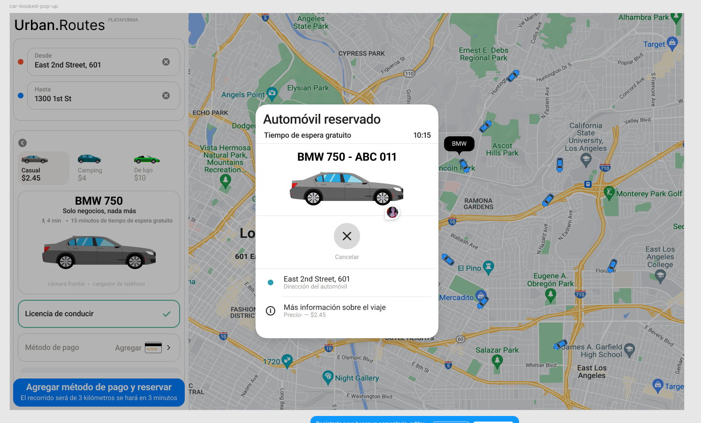
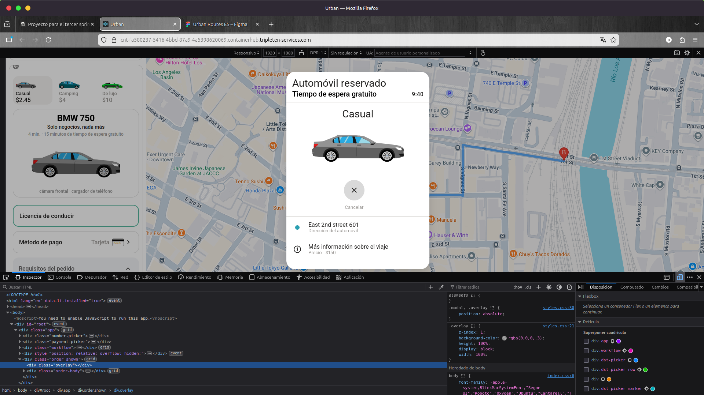

# Qa-Project-3-Web-Application-Testing

  

## 📋 Project Description

Validate the critical functionality of "car sharing" on the Urban Routes platform, ensuring a consistent user experience through cross-platform testing and technical analysis of requirements.

---

### 📂 Project Resources & Assets
* **📋 Requirements:** [View Functional Requirements (PDF)](https://practicum-content.s3.us-west-1.amazonaws.com/new-markets/qa-sprint-3/ES/v6/V6_Requisitos_para_la_funcionalidad_Compartir_un_automvil.pdf)
  
* **🎨 UI/UX Design:** [Figma Interactive Prototype](https://www.figma.com/file/I6nSmK36O9DINiDCYZsZeS/Urban-Routes-ES?type=design&node-id=2-17466&mode=design&t=ghRVbcO2oa8Wrw6l-0)

---

## ✅ Activities Performed

🚀 **Critical Flow Functional Testing:** Execution of end-to-end tests on the "car sharing" functionality of Urban Routes.

📏 **Cross-Platform and Responsive Validation:** System verification at specific resolutions (800x600 and 1920x1080) to ensure visual and operational consistency.

⚖️ **Requirements and Design Analysis:** Identification and reporting of discrepancies between Figma prototypes and business technical documentation.

🌐 **Cross-Browser Testing:** Ensuring software compatibility and stability across Google Chrome and Firefox browsers.

📄 **Technical Documentation Management:** Creation of bug reports and detailed test cases using professional templates.

## 📑 Test Planning & Strategy

<table width="100%">
  <tr>
    <td><b>🎯 Scope</b></td>
    <td>User Interface (UI), reservation flow, and payment module validation.</td>
  </tr>
  <tr>
    <td><b>🚫 Out of Scope</b></td>
    <td>Backend database validation, API Testing, Automation testing.</td>
  </tr>
  <tr>
    <td><b>✅ Entry Criteria</b></td>
    <td>Stable environment, finalized Figma designs, and SRS (Software Requirements Specification) documentation.</td>
  </tr>
  <tr>
    <td><b>🏁 Exit Criteria</b></td>
    <td>Test cases and checklists executed and validated.</td>
  </tr>
</table>

  <video src="https://github.com/user-attachments/assets/664269c0-d4d9-4ba8-94df-a15d21c344fc" width="90%"></video>
  
<b><i>🔍 HTTP status code validation and JSON object inspection video.</i></b>

## 📊 Test Execution Metrics

  
<b><i>Click here to view Design Checklist details</i></b>

  #### 📝 Design Checklist
 | Category | Results |
  | :--- | :---: |
  | 🚀 **Total Tests Executed** | `40` |
  | ✅ Passed Cases | `26` |
  | 🐞 Failed Cases (Bugs Found) | `13` |
  | 🚨 Critical/High Severity Defects| `7` |

## 📂 Project Documentation
[Platform Design-Checklist](https://docs.google.com/spreadsheets/d/19k4fxQPiG2Yx6A8vnBvcked7_ut4JyRVegi3saRT2I0/edit?usp=sharing)

  
  
<i>Comparison: 👉 Figma Prototype (Left) vs. Urban Routes Implementation (Right).</i>

  
<b><i>Click here to view Payment Method and Add Credit Card Checklist details</i></b>
 
  
#### 💵 Payment Method and Add Credit Card Checklist 💳
 | Category | Results |
  | :--- | :---: |
  | 🚀 **Total Tests Executed** | `27` |
  | ✅ Passed Cases | `11` |
  | 🐞 Failed Cases (Bugs Found) | `16` |
  | 🚨 Critical/High Severity Defects| `16` |

## 📂 Project Documentation
[Payment Method and Credit Card - Checklist](https://docs.google.com/spreadsheets/d/10LcLl5GzizlSo9Pef4j0qXU1_e-ULg3JG1wy3aUg2bE/edit?usp=sharing)

  
  
<i>👉 Triple Validation: Comparison of acceptance criteria vs. Figma design vs. final platform functionality" field.</i>

  
<b><i>Click here to view Test Cases and Testing: "Reservation" Button Logic details</i></b>
 
  
#### 🧠 Test Cases and Testing: "Reservation" Button Logic ⚙️
| Category | Results |
  | :--- | :---: |
  | 🚀 **Total Tests Executed** | `7` |
  | ✅ Passed Cases | `3` |
  | 🐞 Failed Cases (Bugs Found) | `4` |
  | 🚨 Critical/High Severity Defects| `3` |

## 📂 Project Documentation
[Test Cases and Testing: "Reservation" Button Logic](https://docs.google.com/spreadsheets/d/159Nwa0gKaM9fOVdTFR8A96DRYKhSB0iiKJWn47BoGnE/edit?usp=sharing)

  <video src="https://github.com/user-attachments/assets/cbd8bfed-9bf3-4c82-b1f4-7bb414528b9c" width="90%"></video>
  
<b><i>🚗 Vehicle Reservation Flow video.</i></b>

  
<b><i>Click here to view Testing and Test Cases for Reservation Functions Logic details</i></b>
 
  
#### ⚙️ Testing and Test Cases for Reservation Functions Logic 🔄
| Category | Results |
  | :--- | :---: |
  | 🚀 **Total Tests Executed** | `11` |
  | ✅ Passed Cases | `5` |
  | 🐞 Failed Cases (Bugs Found) | `6` |
  | 🚨 Critical/High Severity Defects| `3` |

## 📂 Project Documentation

[Testing and Test Cases for Reservation Functions Logic](https://docs.google.com/spreadsheets/d/1MLsKwxC9CrJcsc9FhgRhtAMN8rgbROLUCNCrQLvdeVU/edit?usp=sharing)

  
  
<i>🌐 Cross-browser Testing: Reservation Function Logic Validation in Firefox (1920x1080p).</i>

### 🎨 UI & Design Validation (Figma vs. Implementation)

<table>
  <tr>
    <td align="center"><b>Figma Design (Requirement)</b></td>
    <td align="center"><b>Live Web Implementation</b></td>
  </tr>
  <tr>
    <td></td>
    <td></td>
  </tr>
</table>

<i>🔍 UI Discrepancy Detected: The system fails to display the car brand and license plate number. Instead, it incorrectly shows the selected category (Resolution 1920x1080).</i>

<b>🐛 Bug Report #S1PF-18: Payment Method Validation Failure</b>

 
<ul>
  <li><b>Severity:</b> Critical 🔴</li>
  <li><b>Priority:</b> High ⬆️</li>
  <li><b>Steps to Reproduce:</b>
    <ol>
      <li>Go to "Add Card" section.</li>
      <li>Enter invalid card number (e.g., "9999999999999999").</li>
      <li>Enter 2-digit CVV / CVC (e.g., "12").</li>
      <li>Click "Save".</li>
    </ol>
  </li>
  <li><b>Expected Result:</b> System should trigger an error message for invalid format.</li>
  <li><b>Actual Result:</b> System accepts the card and proceeds to the next step.</li>
  <li><b>Environment:</b> Firefox 148.0.2 (64-bit).</li>
</ul>

## Conclusion

<blockquote>
  As a user, my overall impression of Urban Routes is that, although it presents several issues and can be somewhat inconvenient to use at times, it has also been a satisfying experience due to the challenges it presents. Working with the platform allowed me to develop skills and face interesting situations.
</blockquote>

 

### 🧪 Testing Performed

Both interface and specific functionality tests were carried out, using the document <i>“Requirements for the Car Sharing Functionality”</i> and <b>Figma</b> designs as references.

<table width="100%">
  <tr>
    <td><b>⚙️ Functionality</b></td>
    <td><b>🖥️ Interface</b></td>
  </tr>
  <tr>
    <td>
      <ul>
        <li>Interaction with the “Reservation” button.</li>
        <li>Adding payment methods (bank card).</li>
        <li>Measuring waiting time.</li>
      </ul>
    </td>
    <td>
      <ul>
        <li>Cross-browser & resolution validation.</li>
        <li>Platform-wide spell check.</li>
        <li>Pop-up windows interaction.</li>
      </ul>
    </td>
  </tr>
</table>

<i>The tests were conducted efficiently, covering all planned cases.</i>

---

### ⚠️ Issues Identified

  <ul>
    <li>Failures when adding a bank card.</li>
    <li>Issues when registering a driver’s license.</li>
    <li>Errors when canceling a trip.</li>
    <li>Inconsistencies in the timer.</li>
  </ul>
  

  

  <h3 style="color: #d73a49; margin-top: 0;">🛑 Critical UI Bug</h3>
    A <b></b> When reserving a vehicle, it does not appear on the map, even though it should.
  

  

  <h3 style="color: #d73a49; margin-top: 0;">🛑 Critical Bug Report – Payment Method (Bank Card)</h3>
  
  

    A <b>critical defect</b> was identified in the bank card functionality, where the system allows input formats that do not comply with the defined requirements, including invalid and non-existent data. This represents a <b>high-severity issue</b> due to its potential impact on data integrity and transaction reliability.
  

  

    Through the application of <b>Equivalence Class Partitioning</b> and <b>Boundary Value Analysis</b>, multiple defects were detected across the input fields. These issues indicate insufficient validation mechanisms and highlight the need for stricter input controls aligned with business rules.
  

